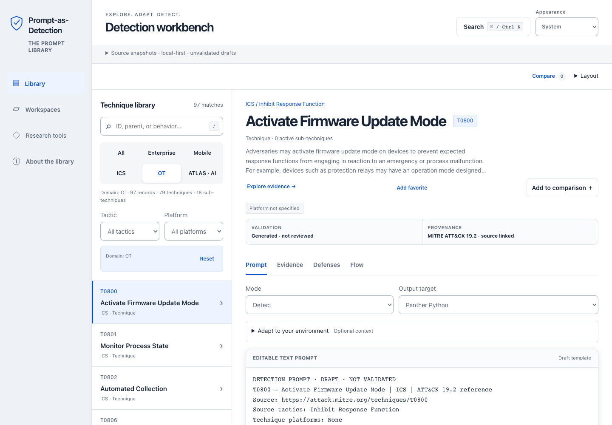

# Prompt-as-Detection Library

Turn MITRE ATT&CK and ATLAS evidence into reviewable detection, hunting and triage
prompts. Browse **1,115 techniques and subtechniques**: 918 from ATT&CK 19.2 and
197 from ATLAS 2026.08. Inspect their source guidance and export drafts from a
browser workbench or local CLI.

The current `0.4.0.dev1` development snapshot adds a unified technique desk and
portable private workspaces to the research foundation. It is not stable v1.0.
Pinned source content and detection prompt bytes are preserved. No draft is
described as operationally validated without evidence.

## Try it in your browser

**[Open the live demo →](https://samran2.github.io/Prompt-as-Detection-Library/)**

[Open research tools →](https://samran2.github.io/Prompt-as-Detection-Library/research.html)
Navigator coverage, CAR analytics, Attack Flow authoring, manual observable
assessments and offline lab evidence exchange. [Guide](docs/research-tools.md).

Search the pinned library, adapt a prompt and download it directly in your browser.
No installation, account or API key needed. Prompts remain unvalidated drafts;
the demo does not run a model or execute detection rules.

[](https://github.com/samran2/Prompt-as-Detection-Library/actions/workflows/ci.yml)
[](https://github.com/samran2/Prompt-as-Detection-Library/actions/workflows/codeql.yml)

[Quick start](#run-it-locally) · [ATT&CK provenance](docs/source-provenance.md) · [ATLAS AI](docs/atlas.md) · [D3FEND defenses](docs/d3fend.md) · [Validation program](docs/validation-program.md) · [Roadmap](ROADMAP.md)

[Workbench guide](docs/premium-workbench.md) · [Workspace format](docs/workspace-format.md) · [Privacy and local storage](docs/privacy.md)

[](https://samran2.github.io/Prompt-as-Detection-Library/)

*Development workbench. [Workspaces](docs/screenshots/premium-workspace.png) ·
[Mobile view](docs/screenshots/premium-mobile.png). Test and hosted outcomes are
recorded in the [verification record](docs/verification.md).*

## What you can do

- **Find the right technique.** Search Enterprise, Mobile, ICS/OT and ATLAS AI; filter by tactic
  or platform, with bounded pages of 50 records.
- **Inspect the evidence.** Read complete source descriptions, linked analytics,
  telemetry references, tuning variables and documented procedure examples.
  ATLAS adds linked case studies, mitigations and source threat maturity, without
  presenting them as tested detections.
- **Stay with one technique.** Prompt, Evidence, Defenses and Flow share the
  selected record. Evidence groups source guidance, the relationship map and CAR;
  comparison opens separately without replacing the editing view.
- **Choose the task and format.** Use Detect, Hunt, Triage or Validate with
  Platform-neutral, Panther Python, Sentinel KQL, Defender XDR, Splunk SPL or Sigma output.
- **Compare evidence.** Keep a shareable search URL, compare two techniques and
  inspect the technique → telemetry → ATT&CK analytic → native-rule readiness map.
- **Keep drafts reviewable.** Edit browser text, copy or download TXT, and export
  filtered templates as JSONL or current-record research JSON. The CLI adds prompt
  and export checksums.
- **Choose your display.** Use the system, light, dark or high-contrast theme with
  keyboard-visible focus and reduced-motion support. Adjust the list width, use
  mobile list/detail navigation, or open command search for techniques and actions.
- **Carry your research.** Name workspaces, favorite techniques and build named
  collections. Export drafts with their original templates and context to a
  portable JSON file; preview an import before opening it as a new workspace.
  Optional, consent-based local autosave uses unencrypted browser storage.
- **Explore defensive context.** Open D3FEND for source-linked countermeasures,
  artifact relationships and a separate defensive research brief. The pinned
  1.6.0 supplement maps 311 Enterprise and 58 ICS/OT records; missing Mobile,
  ATLAS and other exact mappings are explicit, not guessed. Relationships are
  inferred context, not validated protections. [Scope and examples](docs/d3fend.md).
- **Connect research workflows.** Export domain-specific Navigator layers, inspect
  102 pinned CAR analytics (exact mappings to 117 active Enterprise IDs), author
  linear Attack Flow hypotheses and document manual robustness assessments.
  Prepare offline lab plans and import bounded result envelopes without executing
  Caldera or changing validation status. Compare proposed ATT&CK bundles locally
  before any source upgrade. [Research tools](docs/research-tools.md).

No account, API key, model service or runtime package installation is required.
Browser context and edits stay in memory by default and clear on reload unless
you export a file or enable local autosave. IndexedDB storage is unencrypted and
shared by pages on the same origin, not isolated by a GitHub Pages project path.
Avoid sensitive data on shared browser profiles. Copy and TXT preserve editor
text; filtered JSONL exports fresh templates without editor changes. Workspace
files deliberately include analyst context: inspect them before sharing.

Prompts are **unvalidated drafts**. Output targets describe the requested format;
they are not verified integrations. No model calls or detection queries execute.
Source coverage and passing checks do not establish detection effectiveness.

## Evidence status

| Gate | Current measured state |
| --- | ---: |
| Active ATT&CK 19.2 prompts | 918 / 918 generated |
| ATLAS 2026.08 prompts | 197 / 197 generated |
| Automated static prompt contract | 918 / 918 pass |
| Required ATT&CK independent human reviews | 0 / 1,836 complete |
| Required ATLAS independent human reviews | 0 / 394 complete |
| ATT&CK native backend support cells | 0 assessed / 3,672 total |
| Lab-validated prompts | 0 |
| Field-confirmed prompts | 0 |
| Stable v1.0 release | Blocked by evidence gates |

The machine-readable [prompt registry](content/prompts/index.json),
[native-rule support matrix](content/native-rules/support-matrix.json) and
[review summary](validation/results/review-summary.json) make these limits
auditable. See the [evidence contribution guide](docs/evidence-contributions.md)
to help move a record forward without weakening the standard.
The [static scorecards](validation/evals/static/summary.json) evaluate source
grounding, ATT&CK alignment, telemetry feasibility language, benign-lookalike
handling, safety, citations and platform assumptions for every prompt. They do
not advance human-review or validation maturity.
These existing scorecards and support matrices cover ATT&CK only. ATLAS has a
separate [generated inventory](content/atlas/index.json) and
[source-parity evidence](content/atlas/coverage.json), not completed expert or
lab reviews. ATLAS `Realized`, `Demonstrated` and `Feasible` describe source
threat maturity, never the validation status of our prompts.

## Run it locally

Download or clone the repository. For a consistent local preview with clipboard,
workspace cryptography and optional browser storage, use Python 3.11 or later:

```sh
python3 -m http.server 8766 --bind 127.0.0.1 --directory demo
```

Open [localhost:8766](http://127.0.0.1:8766/). The preview serves only the browser
assets; keep the repository root and private working files outside the site.
Directly opening `demo/index.html` is a basic browsing option, but browser support
for secure-context features and file-origin storage varies; prefer loopback HTTP.

### Local CLI

Use Node.js 22 or later from the repository directory. No `npm install` is needed:

```sh
npm run library:help
node scripts/library_cli.cjs list
node scripts/library_cli.cjs prompt T1059.001
node scripts/library_cli.cjs list --domain ATLAS
node scripts/library_cli.cjs prompt AML.T0051
node scripts/library_cli.cjs defenses T0800
node scripts/library_cli.cjs export --output ./detection-prompts.jsonl
```

The export example creates `detection-prompts.jsonl` in the current directory;
it must not already exist. CLI help covers selectors, modes, targets and
literal context files. See the [development guide](docs/development.md) for details.
Default list/export commands retain the 918-record ATT&CK contract. Select
`--framework ATLAS` for AI only or `--framework all` for both frameworks.

### Experimental local research API

Run the read-only reference service locally with `npm run api:start`. It binds
to `127.0.0.1:8781` by default and exposes the development OpenAPI contract for
techniques, prompts, versions, relationships and search. It is not the hosted
GitHub Pages demo and must not be exposed directly to the internet. See the
[API guide](docs/api.md) for current and future boundaries.

### Optional Rösti enrichment

The local-only Rösti adapter can relate a report to this catalog when Rösti
provides an explicit active ATT&CK technique ID. It aggregates IOC values away by
default and never counts external mapping as human or lab validation:

```sh
node scripts/rosti_sync.cjs \
  --report REPORT_ID \
  --output /absolute/private/path/rosti-enrichment.json
```

Read the [Rösti integration boundary](integrations/rosti/README.md) before use.
Inject `ROSTI_API_KEY` with a trusted secret manager before running; do not type
the value into the command itself or save it in shell history. Output must remain
outside the source repository. Review the rights of each underlying publisher
item before redistribution.

## Pinned coverage

| ATT&CK 19.2 domain | Active techniques and subtechniques |
| --- | ---: |
| Enterprise | 697 |
| Mobile | 124 |
| ICS | 97 |
| **Total** | **918** |

The **ATLAS 2026.08 AI section** separately includes **114 parent techniques +
83 subtechniques = 197 prompts**, with 16 tactics, 72 case studies and 39
mitigations in its pinned source. It is not an ATT&CK domain or a claim of extra
ATT&CK coverage. See [ATLAS sources, limits and usage](docs/atlas.md) and the
[AI text prompts](content/atlas/prompts/).

The ATT&CK library includes **378 parent techniques**, **540 subtechniques**,
**18,885 procedure relationships** and **2,053 linked analytics**. Each active
record has a readable [text prompt](library/prompts/). Revoked and deprecated
records are excluded from active prompts; source gaps and unlinked analytics
remain explicit in the [coverage evidence](library/coverage.json).

This is an **independent rebuild** from official pinned MITRE data, development
version `0.4.0.dev1` (npm `0.4.0-dev.1`). The original v0.2.0 archive remains
unavailable; this project does not claim to restore its implementation or formats.
Read the [source provenance](docs/source-provenance.md) for the exact commit,
source hashes, attribution and inclusion policy.

The earlier dev3 [prompt-quality review](docs/prompt-quality-review.md) covers
improved drafting instructions, not validated detections. Historical hosted
results remain in the [verification record](docs/verification.md); they do not
prove later changes or satisfy the development line's evidence gates.

## Verify and build

```sh
npm run library:verify
npm run atlas:verify
npm run d3fend:verify
npm run car:verify
npm run research:check
npm run reviews:verify
npm run evals:verify
npm run check
npm test
npm run build
```

`library:verify` compares exact source/output identifiers and generated bytes
without rewriting them. `library:build` intentionally regenerates the pinned
library. `atlas:verify` independently checks the pinned AI source and generated
files. `d3fend:verify` independently verifies the defensive supplement. The static
build verifies the pinned supplements and research modules before copying only
the explicit public-file allowlist to a new `dist/`; preserve an existing build
before rebuilding. Workspace files, stored analyst data and QA tools are never
build inputs.

The browser, CLI and text generator share `demo/core.js`. Raw source bundles,
complete procedure records, tests and private work stay outside the static build.
See [verification](docs/verification.md) for actual checks and their limits.

## Explore the project

| Guide | What it covers |
| --- | --- |
| [Architecture](docs/architecture.md) | Shared composition, data flow and the static file boundary. |
| [Premium workbench](docs/premium-workbench.md) | Unified technique desk, commands, private workspaces and recovery. |
| [Privacy](docs/privacy.md) | Memory-only defaults, optional plaintext storage and explicit deletion. |
| [ATLAS AI](docs/atlas.md) | AI threat coverage, source maturity, local usage and separate licensing. |
| [Data contracts](docs/data-contracts.md) | Versioned schemas and cross-record evidence invariants. |
| [Research API](docs/api.md) | Read-only `/v1` contract and current implementation boundary. |
| [Development](docs/development.md) | CLI contracts, generation, browser QA and repository checks. |
| [Agent skills](docs/agent-skills.md) | Pinned project-local engineering workflows for Codex, with shared checklists and offline verification. |
| [Contributing](CONTRIBUTING.md) | Focused changes, source fidelity and review expectations. |
| [Governance](GOVERNANCE.md) | Maintainer roles, DCO decisions and evidence approvals. |
| [Prompt quality review](docs/prompt-quality-review.md) | Semantic sample, shared-template improvements and validation limits. |
| [External detection comparison](docs/external-detection-review.md) | Public-summary comparisons, corroboration and rule-reuse boundaries. |
| [Security](SECURITY.md) | Private vulnerability reporting, trust boundaries and review scope. |
| [Release process](docs/release-process.md) | Candidate gates, signed evidence, publication and rollback. |
| [Repository settings](docs/repository-settings.md) | Required GitHub rules and current activation limits. |
| [Roadmap](ROADMAP.md) | Current delivery and separately scoped future work. |

## License and attribution

Original code and associated documentation use the [MIT License](LICENSE),
Copyright (c) 2026 samran2. Vendored development skills retain
[Addy Osmani's MIT notice](.agents/AGENT_SKILLS_LICENSE). Reproduced ATT&CK content retains separate
[MITRE terms](sources/attack-19.2/raw/LICENSE.txt); the
[static notice](demo/THIRD_PARTY_LICENSE.txt) includes both complete licenses.
ATLAS source content retains its [MITRE Apache-2.0 notice and license](demo/ATLAS_LICENSE.txt).
See the [licensing record](docs/licensing.md) for scope. External evidence and rule
contributions require item-level SPDX and provenance. This independent project is
not endorsed by MITRE, Apple, Google, VirusTotal or Rösti. The npm packages remain
private; no stable release is claimed.
