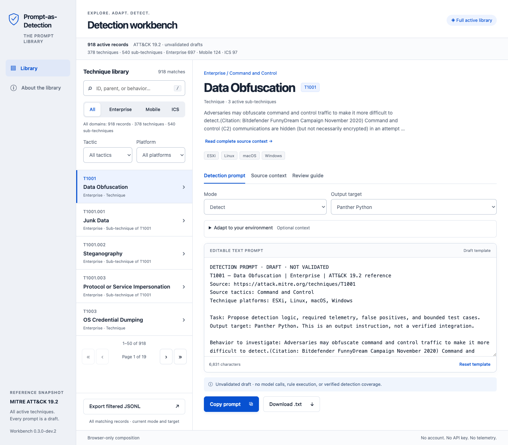

# Prompt-as-Detection Library

Readable detection prompts for every active MITRE ATT&CK 19.2 technique and
subtechnique, with a local browser workbench and command-line export.

Development version **0.3.0.dev2** (npm `0.3.0-dev.2`). This is an independent
rebuild from official source data. The original v0.2.0 archive remains unavailable;
its implementation, tests and byte-level content have not been recovered.
The complete library has passed the recorded local publication checks.
GitHub publication awaits confirmation of public repository visibility.

## Coverage

The pinned scope is **918 active techniques and subtechniques**: 697 Enterprise,
124 Mobile and 97 ICS, comprising 378 parents and 540 subtechniques. The source
contains 18,885 qualifying procedure relationships and 2,053 linked analytics.
Revoked or deprecated techniques are excluded from active prompts and listed in
the coverage evidence. The 13 unlinked active analytics remain in the raw source;
the rebuild does not invent technique links for them.

Read [source provenance and coverage](docs/source-provenance.md), inspect
[coverage evidence](library/coverage.json), and run `npm run library:verify` to
compare the generated catalog and text files with the pinned inputs. Completeness
is checked by identifier sets, not totals alone. Every active record has a
readable text prompt under `library/prompts/`.

Prompts are **unvalidated drafts**. Catalog coverage and structural checks do not
demonstrate model quality, successful detection, or production suitability.

## Open the workbench



Extract the repository and open `demo/index.html` in a modern browser. For local
HTTP preview and the best clipboard support, use Python 3.11 or later:

```sh
python3 -m http.server 8766 --bind 127.0.0.1 --directory demo
```

Open `http://127.0.0.1:8766/`. Search by ID, name or behavior; filter by domain,
tactic and platform; inspect source descriptions, linked analytics and procedure
examples; then choose a mode and target. Browse results in pages of 50.

The browser needs no account, API key, model service or runtime dependencies.
Context and edited drafts stay in browser memory and disappear on reload.
Source links leave the page only when clicked. Use synthetic context for reviews
and screenshots. Copy and TXT download preserve the editor text; filtered JSONL
exports fresh templates, excluding editor changes.

## Use the local CLI

Node.js 22 or later is required. No package installation is needed for runtime,
generation or unit checks. Run commands from the extracted repository:

```sh
npm run library:help
node scripts/library_cli.cjs list
node scripts/library_cli.cjs prompt T1059.001
node scripts/library_cli.cjs export --output /absolute/new-file.jsonl
```

Use CLI help for selectors, modes, targets and context-file options. Exports
refuse existing files, include a SHA-256 for each prompt, and report a SHA-256
for the complete JSONL file. These are the independent rebuild's documented
formats, not a compatibility claim for the unavailable original application.

## Verify and build

```sh
npm run library:verify
npm run check
npm test
npm run build
```

`library:verify` checks generated bytes without writing. `library:build`
deliberately regenerates the catalog, readable prompts and coverage artifacts
from the pinned local source. The static build verifies the library before
copying exactly eight allowlisted files to a new `dist/`. It rejects an existing
output directory; preserve or move a previous build before rebuilding.

The raw source bundles, all procedure records, tests and local work never enter
`dist/`. The full catalog has a 16 MiB limit; each other public asset has a 2 MiB
limit. See [development](docs/development.md) for browser and foundation checks,
and the [verification record](docs/verification.md) for actual results and limits.

## Repository map

| Path | Purpose |
| --- | --- |
| `sources/attack-19.2/` | Pinned raw source bundles, hashes and MITRE notice. |
| `library/prompts/` | One readable detection prompt per active record. |
| `library/procedures.jsonl` | All qualifying source procedure relationships. |
| `library/coverage.json` | Reproducible coverage and source identity evidence. |
| `demo/` | Complete static workbench; sole public-site source. |
| `scripts/` | Shared-library generator, CLI, static builder and checks. |
| `tests/`, `qa/` | Local behavior tests and isolated optional browser tooling. |
| `docs/`, `tasks/` | Architecture, provenance, verification and implementation plan. |
| `.github/` | CI, manual archive preview and manual Pages deployment. |

The browser, CLI and text generator share `demo/core.js`. Python is used for
preview and repository checks; this rebuild does not provide the original
`python -m huntprompt serve` command or its response evaluator.

## Publication and licensing

No remote, GitHub release, package or hosted site has been created by this work.
The owner requested publication to account `samran2`, repository
`Prompt-as-Detection-Library`. Public visibility still requires confirmation;
this is not a verified live repository URL.
The Pages workflow requires an explicit manual publication decision.

Original project code and associated documentation use the [MIT License](LICENSE),
Copyright (c) 2026 samran2, as approved by the owner. MITRE source data and reproduced
ATT&CK text retain their separate [MITRE terms](sources/attack-19.2/raw/LICENSE.txt).
The [static distribution notice](demo/THIRD_PARTY_LICENSE.txt) contains the full
MITRE terms and project MIT license. The
[resolved licensing record](LICENSE_TODO.md) documents this distinction; this
repository does not grant new rights to the missing original application.
The package remains private. See [publishing](docs/publishing.md),
[CONTRIBUTING](CONTRIBUTING.md) and [SECURITY](SECURITY.md) before distribution.
