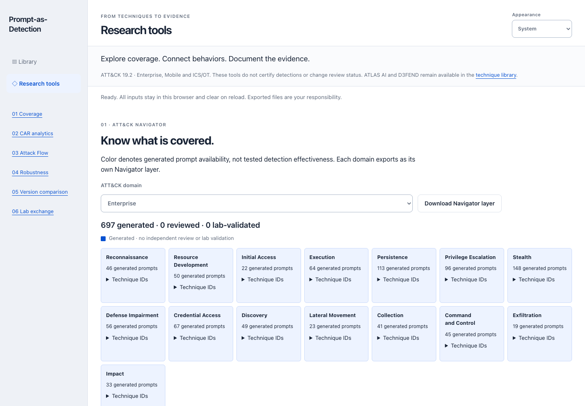

# Local research tools

Open `demo/research.html`, choose **Research tools** in the workbench, or use the
[hosted research page](https://samran2.github.io/Prompt-as-Detection-Library/research.html).
The page is a separate static entry point so the prompt workbench does not load
additional research catalogs. It uses the existing design tokens and themes.



| Tool | What works | Important limit |
| --- | --- | --- |
| [Navigator](navigator.md) | Enterprise/Mobile/ICS tactic coverage and layer JSON | Generated availability, not tested detection coverage |
| [CAR](car.md) | 102 pinned analytics; hypothesis, pseudocode and source telemetry | 117 exact active Enterprise IDs, no inherited mappings |
| [Attack Flow](attack-flow.md) | Reorder/remove 2–20 steps and export a STIX hypothesis | Linear ATT&CK flows, not the entire upstream editor |
| [Robustness](robustness.md) | Manual evidence-backed assessment of one observable | User-assessed, not certification or aggregate analytic scoring |
| [Version comparison](attack-diff.md) | Local full-bundle proposal diff and prompt impact | CLI; no automatic dataset upgrade |
| [Lab exchange](lab-exchange.md) | Hash-bound plan, result template and bounded local import | Project envelope, not a native Caldera report or execution client |

## A research session

1. Select a domain and download its Navigator layer. Open that file in a
   compatible Navigator installation when desired; this app never uploads it.
2. Look up a technique in CAR and read the pinned hypothesis and provenance.
   An empty result is a source gap, not a reason to infer a mapping.
3. Search and add technique steps to a hypothetical Attack Flow. Give it a title,
   reorder with the named buttons, and download the interoperable JSON bundle.
4. For a particular observable, enter an explicit robustness level, origin,
   telemetry, reasoning, benign context and evidence reference. Export a manual
   assessment for human review, not as a validation certificate.
5. Use the selected steps to prepare a separately authorized lab plan. Download
   its result template, supply real artifact hashes outside this app, then import
   the completed project envelope. Placeholders are rejected. An accepted envelope
   establishes structural consistency only; the private artifacts are not inspected.

All entered content lives in memory and clears on reload. To import results in a
later session, recreate the same selection, title and authorization reference so
the deterministic plan identity matches. Changing plan inputs invalidates previous
imports. Do not enter secrets or personal data; exported files persist on disk
and must be inspected before sharing. No API key, upload, model call or attack
execution exists in this page.

## Source and format scope

ATT&CK 19.2 remains pinned. ATLAS and D3FEND remain separate library capabilities;
these new visual tools initially select ATT&CK records only. CAR's Apache-2.0
license and NOTICE are visible with every lookup. Attack Flow exports include
the upstream extension's license notice. Navigator describes only the current
generated baseline; real future reviews require an evidence-bound projection.

Caldera is now **Apache Caldera (Incubating)**, not a newly embedded MITRE service.
The browser produces a project-specific research exchange format; operating an
authorized external lab and mapping native reports remain the operator's work.

## Development and checks

```sh
npm run car:verify
npm run research:check
npm test
npm run build
node scripts/attack_diff.cjs --domain ICS --candidate /absolute/path/to/ics-bundle.json
```

The diff command requires an absolute candidate path. It prints JSON without creating files.
`npm run build` refuses an existing `dist` directory. Preserve or move an earlier
build before rebuilding. Browser regressions run through the existing
`scripts/browser_smoke.cjs` harness; see [development](development.md).
