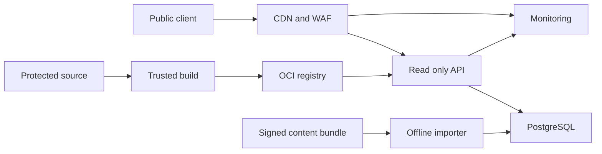

# Research API Threat Model

## Executive summary

The repository now includes a loopback-first, dependency-free read-only reference
service and OCI image, but no internet-facing deployment or public API beta. The
highest risks in the local implementation are resource exhaustion, contract or
cache-version confusion, accidental network exposure and supply-chain compromise.
The future hosted design additionally introduces PostgreSQL, privileged imports,
edge infrastructure and operations. Excluding accounts, uploads, model execution,
malware samples, and user content sharply limits confidentiality and cross-tenant
risk, but these exclusions must remain enforced in code and infrastructure.

## Scope and assumptions

In scope are the implemented Node.js reference service, OpenAPI 3.1 boundary,
immutable in-memory catalog adapter, explicit client, OCI image and build pipeline.
The future public-beta analysis also covers a proposed TypeScript service,
PostgreSQL catalog, immutable content importer, read-only STIX/TAXII surface,
CDN/WAF, observability, migrations and operator controls. The static workbench is
modeled separately and does not call the API.

Plan-confirmed assumptions:

- The beta is public and internet-facing, with no user accounts or write API.
- Only public, approved research objects are returned.
- Prompts, logs, malware samples, private collections, and model runs are excluded.
- PostgreSQL is the production store and the service ships as a portable OCI image.
- Target load is 100 requests per second, p95 below 250 ms, and 99.9% monthly
  availability, subject to future measured evidence.

Open operational questions are the deployment owner, provider and regions, edge
and log retention, incident-response rotation, backup objectives, and exact admin
identity system. Rankings assume one public dataset, no multi-tenancy, TLS at the
edge, and a separate authenticated, non-public import path.

## System model

### Primary components

- The current reference service binds to loopback by default, accepts only GET and
  HEAD, validates bounded filters and cursors, and reads an immutable verified
  catalog snapshot.
- The current client performs network requests only after explicit construction by
  a caller. Existing browser and CLI workflows remain offline.
- The current non-root OCI image packages only allowlisted runtime files and both
  project and ATT&CK license notices.

- CDN/WAF terminates public TLS, caches immutable reads, and applies coarse limits.
- TypeScript API validates OpenAPI inputs, applies application rate and cost bounds,
  queries public records, and returns versioned responses.
- PostgreSQL stores immutable published versions and typed relationships; the API
  role is read-only.
- A privileged offline importer validates signed release manifests and performs
  transactional version activation through a separate operator identity.
- CI builds the OCI image and contracts, scans them, emits SBOM/provenance, and
  signs artifacts.
- Monitoring receives bounded metadata and alerts without request or response bodies.

The first three components are implemented local controls; the internet edge,
PostgreSQL, importer, deployment and observability components remain proposed.
Design evidence is in
`docs/api.md`, `docs/data-contracts.md`, and
`governance/decisions/0003-postgresql-oci-production-service.md`.

### Data flows and trust boundaries

- Internet client → CDN/WAF: route, filters, cursors, and headers cross HTTPS; edge
  size/rate limits and bot controls are required, with no authentication for reads.
- CDN/WAF → API: normalized HTTP requests cross an internal TLS boundary; the API
  independently enforces OpenAPI validation, deadlines, and cost limits.
- API → PostgreSQL: parameterized read queries cross a private network using a
  least-privilege read-only role, TLS, connection limits, and statement timeouts.
- Release bundle → importer: signed objects, schemas, hashes, and licenses cross a
  privileged operator boundary; signature, provenance, schema, and referential
  integrity must all pass before an atomic version activation.
- CI source → registry/deployment: source and dependencies become OCI images and
  attestations; protected workflow identity, SHA-pinned actions, scans, SBOM, and
  Sigstore constrain the boundary.
- API/edge → monitoring: route template, status, latency, request ID, and coarse
  abuse signals cross an operational boundary; payloads and sensitive query values
  are excluded and retention is bounded.

#### Diagram

## Assets and security objectives

| Asset | Why it matters | Security objective (C/I/A) |
| --- | --- | --- |
| Published research objects | Consumers may automate defensive decisions from them. | I, A |
| Version, relationship, and validation state | Tampering can create false provenance or confidence. | I |
| Importer and migration authority | Can change all data exposed by the service. | C, I |
| CI identity and OCI image | Compromise can replace service code at scale. | C, I, A |
| PostgreSQL credentials and backups | Enable data tampering or service disruption. | C, I, A |
| Service capacity | Public catalog must remain usable under abuse or spikes. | A |
| Operational metadata | IP and request data may be personal or security-sensitive. | C, I |

## Attacker model

### Capabilities

- An unauthenticated remote attacker can send concurrent requests with arbitrary
  paths, filters, cursors, headers, ordering, and timing within network limits.
- An attacker can replay or cache old public content, enumerate the entire public
  catalog, and compare versions; none of that is a confidentiality breach.
- A compromised contributor, dependency, registry, workflow, or operator credential
  may attempt to change service code or privileged import data.
- An attacker may submit malicious content only if they first cross repository or
  importer approval; the public API itself has no submission endpoint.

### Non-capabilities

- A public caller has no account, tenant, private object, write route, upload,
  arbitrary URL fetch, model tool, or malware sample surface in this design.
- Public catalog enumeration and scraping are expected behaviors until they impair
  availability or violate a documented access policy.
- The model does not assume compromise of TLS, the container runtime, PostgreSQL
  host, or cloud control plane; hardening and monitoring still address these as
  residual supply-chain and infrastructure risks.

## Entry points and attack surfaces

| Surface | How reached | Trust boundary | Notes | Evidence (repo path / symbol) |
| --- | --- | --- | --- | --- |
| `/v1` list and object routes | Local HTTP today; future public HTTPS | Host or Internet → API | Filters, limits, cursor and conditional headers. | `apps/research-api/src/handler.mjs`; `apps/research-api/openapi.yaml` |
| Search | Local HTTP today; future public HTTPS | Host or Internet → API/database | Query complexity and index use are availability-critical. | `apps/research-api/src/handler.mjs` / `GET /v1/search` |
| TAXII/STIX reads | Future public HTTPS | Internet → API/database | Not implemented; future protocol pagination and object filters need the same bounds. | `docs/api.md` |
| Offline content import | Operator-only job | Signed bundle → importer/database | Highest data-integrity privilege; must not share the public listener. | `docs/data-contracts.md`; ADR-0003 |
| Database connection | Internal service call | API/importer → PostgreSQL | API role is read-only; importer role is short-lived and separate. | ADR-0003 |
| OCI build and deploy | Protected workflow | Repository/CI → registry/runtime | Dependencies and workflow identity can alter all responses. | `docs/release-evidence.md` |
| Logs and metrics | Service and edge events | Runtime → observability | Avoid payload and high-cardinality attacker-controlled labels. | `docs/privacy.md` / Future research API |

## Top abuse paths

1. Availability exhaustion: issue many costly search/filter combinations → defeat
   cache reuse → consume database connections/CPU → make catalog reads unavailable.
2. Cursor abuse: craft or replay malformed/stale cursors → trigger expensive decode
   or inconsistent queries → leak implementation detail or amplify workload.
3. Import compromise: steal operator identity or replace a release bundle → pass a
   weak importer → activate falsified prompts, rules, relationships, or validation
   state for every client.
4. SQL injection: place attacker strings in a filter → reach concatenated SQL →
   read system metadata, alter data through an overprivileged role, or disrupt DB.
5. Cache confusion: exploit missing version/filter variation or weak ETags → cause a
   cache to serve a mismatched object/status → corrupt client research conclusions.
6. Image compromise: introduce a malicious dependency or workflow action → build a
   trusted-looking OCI image → deploy it with database/network access.
7. Privacy expansion: log full search text, IPs, headers, or responses → retain
   sensitive analyst interests → expose them through observability access.
8. Scope creep: add an undocumented write, URL-fetch, upload, or model endpoint →
   bypass the assumptions behind this model → introduce SSRF, injection, data
   leakage, or malware-processing risk without controls.

## Threat model table

| Threat ID | Threat source | Prerequisites | Threat action | Impact | Impacted assets | Existing controls (evidence) | Gaps | Recommended mitigations | Detection ideas | Likelihood | Impact severity | Priority |
| --- | --- | --- | --- | --- | --- | --- | --- | --- | --- | --- | --- | --- |
| TM-001 | Remote unauthenticated client | Reference service is deliberately exposed, or a future public query exceeds its rate-limit weight. | Saturate API, edge, connection pool, or database with cache-busting requests. | Degraded or unavailable research service and excess cost. | Service capacity | Loopback default, bounded pages/queries and request timeouts (`apps/research-api/src/server.mjs`, `handler.mjs`). | Hosted rate model, indexes, budgets, and capacity evidence are absent. | Keep local binding; layer edge and application quotas before hosting; cap query cost, response bytes and connections; load-test abuse cases. | Alert on latency, rejection rate, query cost, pool saturation and cache miss ratio. | High | Medium | High |
| TM-002 | Compromised operator or content supply chain | Attacker can invoke importer or supply a bundle accepted as trusted. | Activate falsified content or validation evidence. | Systematic research-integrity compromise. | Catalog, status, provenance | Proposed signed hashes and immutable versions (`docs/data-contracts.md`, `docs/release-evidence.md`). | Importer, separation of duties, and operational identities do not exist. | Isolate importer; require trusted provenance, two approvals, schema and referential checks; stage then atomically activate; retain rollback version. | Alert on imports, manifest/signature mismatch, unexpected counts and active-version changes. | Medium | High | High |
| TM-003 | Remote client | An input reaches dynamic SQL or the API role is overprivileged. | Inject or reshape a database query. | Metadata disclosure, tampering, or outage. | Database, catalog, availability | Parameterized read-only design is proposed in ADR-0003. | No code or database policy exists to verify. | Generate typed boundary validation; parameterize all SQL; fixed query builders; read-only transactions; statement timeout; deny dangerous DB privileges. | Database audit of errors and forbidden statements; injection fixture tests. | Medium | High | High |
| TM-004 | Remote client or intermediary cache | Cache key omits content version, filters, authorization assumptions, or encoding. | Poison or confuse cached responses and validators. | Clients receive wrong versions, relationships, or status. | Catalog integrity | Strong ETag and immutable version semantics are proposed (`docs/api.md`). | CDN configuration and canonical cache keys are undefined. | Put version in canonical path/query; vary only documented headers; sign/hash manifests; test cache keys and conditional requests end to end. | Compare origin and edge hashes; alert on validator/content mismatch. | Medium | Medium | Medium |
| TM-005 | Compromised dependency, action, or registry | Supply-chain change reaches trusted build/deploy identity. | Ship altered API code or image. | Remote code execution in service, data tampering, credential theft. | OCI image, DB credentials, catalog | Proposed SBOM, SHA pinning, Sigstore, SLSA (`docs/release-evidence.md`). | Production build, registry policy, and admission verification are absent. | Lock dependencies; block install scripts by default; minimal non-root image; scan; sign by digest; enforce provenance at deploy; least-privilege runtime identity. | Registry and deployment audit; image digest drift; runtime egress and integrity alerts. | Medium | High | High |
| TM-006 | Service implementation or operator | Logs capture attacker-controlled or identifying data without limits. | Store sensitive queries, headers, IPs, or response bodies; inject high-cardinality labels. | Privacy exposure, monitoring cost, or hidden signals. | Operational metadata, capacity | Data-minimization policy is proposed (`docs/privacy.md`). | Provider fields, retention, and access are undecided. | Allowlist log fields; tokenize or truncate network identifiers; exclude payloads; bound labels; set deletion; restrict access. | Periodic field inventory and retention audit; cardinality/cost alerts. | Medium | Medium | Medium |
| TM-007 | Future contributor or product owner | A new capability bypasses architecture review. | Add write, upload, URL fetch, model, or private-data behavior under existing controls. | SSRF, malware handling, cross-user leaks, prompt injection, or unsafe agency. | Service, credentials, user data | Explicit exclusions plus method-denial contract tests in `tests/research_api.test.cjs`. | Review and policy cannot prevent every future code change. | Retain contract tests and CODEOWNERS; require a new ADR, privacy review, and threat model for scope expansion. | Diff checks for non-GET operations, network clients, upload parsers and new secrets. | Medium | High | High |
| TM-008 | Remote client | Parser accepts oversized, deeply nested, or invalid cursor/header input. | Consume memory/CPU or expose detailed errors. | Localized API denial of service and information disclosure. | Service capacity, implementation detail | Bounded opaque cursors, strict query allowlists and generic errors are implemented and tested. | No hosted WAF, distributed limits or fuzz campaign exists. | Retain constant-work rejection; add raw-byte edge caps and fuzz all boundary parsers before hosting. | Track bounded validation errors and process resource anomalies without payload logging. | High | Low | Medium |

Risk priorities assume a public, single-dataset, read-only service with no private
tenant data. Any account, upload, arbitrary fetch, model execution, or operator
route on the public listener would materially raise TM-003 and TM-007.

## Criticality calibration

- **Critical:** unauthenticated code execution in the API, compromise of signing and
  deployment authority with active exploitation, or destructive database access
  that also defeats recovery.
- **High:** systematic catalog/validation tampering, reachable SQL injection with
  meaningful database access, OCI supply-chain compromise, or sustained public
  outage at intended capacity.
- **Medium:** cache/version confusion affecting a subset of clients, recoverable
  resource exhaustion, or exposure of retained request metadata.
- **Low:** bounded malformed-request noise, enumeration of already public records,
  or a short cache miss with no integrity or availability consequence.

## Focus paths for security review

| Path | Why it matters | Related Threat IDs |
| --- | --- | --- |
| `docs/api.md` | Defines every intended public entry point and request bound. | TM-001, TM-004, TM-008 |
| `docs/data-contracts.md` | Defines immutable identity, provenance, and promotion status. | TM-002, TM-004 |
| `apps/research-api/` | Current local listener, validation, query and error boundary. | TM-001, TM-007, TM-008 |
| `packages/schemas/` | Current JSON Schema contracts; future hosted import boundary. | TM-003, TM-007, TM-008 |
| `content/` | Current prompts, rules, origins and support matrices. | TM-002 |
| `validation/` | Evidence used to justify reviewed and validated status. | TM-002 |
| `.github/workflows/` | Future image build, provenance, signing, and deployment authority. | TM-002, TM-005 |
| `governance/decisions/` | Records the exclusions that constrain API attack surface. | TM-007 |

The model covers the current local reference boundary and proposed public, data,
operator, build, registry and observability boundaries. The operational questions
above must be resolved before converting this design model into a production
sign-off.
