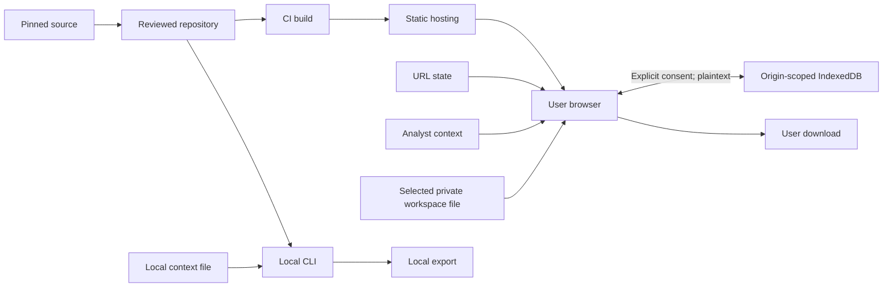

# Static Workbench Threat Model

## Executive summary

The workbench remains a static, unauthenticated catalog with no application
backend, model calls, or analyst-data upload. The `0.4.0.dev1` workspace extension
adds optional plaintext browser storage and explicit private-file imports/exports;
this model describes that candidate, not proof of its deployed verification.
Its most credible risks are published
catalog or JavaScript tampering, untrusted ATT&CK text reaching an unsafe DOM or
link sink, accidental inclusion of private files in the Pages artifact, and users
mistaking generated prompts for validated detections. Existing literal rendering,
URL validation, restrictive CSP, deterministic generation, and an explicit build
allowlist reduce those risks, but release identity and independent content review
remain essential. Opt-in persistence adds shared-device and same-origin exposure,
while imported files and concurrent tabs add integrity and availability risks.

## Scope and assumptions

In scope are `demo/`, `scripts/build_demo.cjs`, `scripts/build_library.cjs`,
`scripts/library_cli.cjs`, `library/`, `sources/attack-19.2/`, and the GitHub Actions
workflows that build or deploy the workbench. Runtime, build/CI, and local CLI risks
are distinguished below.

Assumptions confirmed by the product plan and current repository:

- GitHub Pages serves only the static `dist/` output over HTTPS.
- There is no application server, account, authentication token, analytics SDK or
  model integration. Drafts are memory-only by default. Explicit consent enables
  plaintext IndexedDB persistence; a localStorage flag remembers that consent.
- ATT&CK source data and analyst-entered context are untrusted text.
- The public catalog is not confidential; integrity and provenance matter most.
- Users may download generated drafts but execute them only outside the application.
- Browser storage is scoped to the origin, not the repository path. Other projects
  on the same GitHub Pages origin are not isolated from saved workspaces.

Open operational questions that could change risk are who may approve Pages
deployments, whether GitHub artifact attestations are enforced, and the host's
actual request-log retention. This model assumes a public repository and a manual,
protected deployment workflow.

## System model

### Primary components

- Pinned ATT&CK source bundles and manifest provide developer-controlled build
  inputs after review (`sources/attack-19.2/manifest.json`).
- The deterministic generator derives catalog and prompt files
  (`scripts/build_library.cjs`).
- The packaging step validates and copies only allowlisted files into `dist/`
  (`scripts/build_demo.cjs`, `PUBLIC_FILES`).
- GitHub Actions checks and deliberately deploys the artifact
  (`.github/workflows/pages.yml`).
- A browser loads static files, filters the catalog, renders text, composes drafts,
  and creates downloads (`demo/app.js`, `demo/core.js`).
- A pure bounded workspace contract validates snapshots (`demo/workspace.js`);
  the UI requires import inspection/preview (`demo/workspace-ui.js`), while an
  optional transactional store checks revisions and deletion epochs
  (`demo/workspace-store.js`).
- The local CLI reads the same catalog/core and writes new owner-only export files
  (`scripts/library_cli.cjs`, `writeNewFile`).

### Data flows and trust boundaries

- MITRE source → repository: STIX JSON and license cross an external-source to
  maintainer boundary through files; manifest hashes and deterministic validation
  provide integrity checks, but maintainers approve dataset changes.
- Repository → CI runner: source, scripts, Actions definitions, and dependencies
  cross into ephemeral build compute; checkout is read-only and actions are SHA
  pinned, while workflow permissions bound GitHub-token authority.
- CI artifact → GitHub Pages → browser: allowlisted public UTF-8 files cross the hosting
  boundary over HTTPS; the allowlist, size limits, credential patterns, and CSP
  constrain content, while platform TLS protects transport.
- Catalog and URL state → DOM: untrusted source and URL parameter values cross into
  browser rendering; `textContent`, value assignments, allowlisted state, and
  `safeSourceUrl` prevent HTML interpretation and unsafe source schemes.
- Analyst input → prompt/download: up to 4,000 characters of context crosses into
  in-memory composition and user-initiated files; there is no application upload.
- Workspace file → preview → current state: a selected file is capped at 5 MiB,
  parsed with strict fields/depth/duplicate checks, inspected for template hashes
  and source drift, then opened under a new identity only after confirmation.
- Memory → optional browser store: explicit consent allows plaintext snapshots;
  every save checks the expected revision atomically. Loaded values are untrusted
  and pass the same contract and inspection boundary before restoration.
- Other tabs → shared store: stale revisions fail rather than overwrite. Clearing
  stored workspaces changes an epoch so old store handles cannot recreate them.
- CLI arguments/files → local output: attacker- or operator-controlled paths and
  text cross a local process boundary; strict flags, size/UTF-8 checks, no-follow
  opens, exclusive writes, and symlink rejection reduce filesystem attacks.

#### Diagram

## Assets and security objectives

| Asset | Why it matters | Security objective (C/I/A) |
| --- | --- | --- |
| Catalog, prompts, and provenance | Tampering can misdirect defensive work or falsify coverage. | I, A |
| Analyst context and drafts | May contain environment details despite warnings. | C, I |
| Private workspace files and saved snapshots | Include original templates, edited drafts and context; deletion and concurrent edits must not silently lose or restore data. | C, I, A |
| Public build artifact | It is the code and content users trust in their browsers. | I, A |
| Release workflow identity | Compromise can publish attacker-controlled JavaScript. | C, I |
| ATT&CK and project licenses | Omission creates legal and provenance harm. | I, A |
| Local filesystem outputs | Overwrite or symlink mistakes could damage user files. | C, I, A |

## Attacker model

### Capabilities

- A remote visitor can choose URL state, search text, filters, context, and normal
  browser actions, and can persuade another user to open a crafted workbench URL.
- A malicious source record or contributor can propose hostile strings, URLs, or
  build changes through the repository review boundary.
- A compromised dependency, action, maintainer credential, or GitHub control plane
  could attempt to alter a build or deployment.
- A local adversary may influence CLI arguments, context files, output paths, or
  filesystem links when the user runs commands in a shared directory.
- A file author can supply malformed workspace JSON, forged source labels or
  self-consistent template/hash pairs. A same-origin application or script with
  origin access can read or alter plaintext saved workspaces.

### Non-capabilities

- A normal remote visitor cannot send requests to an application backend because
  none exists, query other users' drafts, or directly execute server commands.
- Browser-generated draft text is not executed by the workbench.
- This model does not assume compromise of the user's browser, operating system,
  GitHub, or MITRE; those remain supply-chain dependencies and residual risks.

## Entry points and attack surfaces

| Surface | How reached | Trust boundary | Notes | Evidence (repo path / symbol) |
| --- | --- | --- | --- | --- |
| URL state and search controls | Browser navigation and user input | Internet/user → DOM | Must be bounded and allowlisted before use. | `demo/app.js`; `demo/index.html` |
| Catalog strings and links | Generated JavaScript asset | Source/repository → DOM | Text must remain literal; links require safe HTTPS validation. | `demo/app.js` / `element`, `safeSourceUrl` |
| Analyst context | Textarea or CLI file | User/local file → composer | May contain secrets; local-only is privacy, not sanitization. | `demo/index.html`; `scripts/library_cli.cjs` / `readContext` |
| Browser download | Copy, TXT, JSONL, research export | DOM → local filesystem | Output is inert data but may later be executed elsewhere. | `demo/app.js` / `download` |
| Workspace file and stored record | File picker or opt-in restore | Untrusted JSON → active workspace | 5 MiB cap, exact fields, original-template hashes, literal text; import preview creates a new identity. | `demo/workspace.js`; `demo/workspace-ui.js` |
| IndexedDB and consent flag | Explicit autosave control | Memory ↔ browser origin | Plaintext, not path-isolated; revision checks and clear epoch prevent cooperative stale writes, not hostile origin code. | `demo/workspace-store.js`; `demo/workspace-ui.js` |
| CLI output path | Command argument | Local process → filesystem | Exclusive write and symlink rules are security-critical. | `scripts/library_cli.cjs` / `writeNewFile` |
| Public packaging | CI or local build | Repository → deployment artifact | Unexpected files or secrets must fail closed. | `scripts/build_demo.cjs` / `PUBLIC_FILES` |
| Pages deployment | Manual workflow dispatch | Repository/maintainer → public hosting | Workflow identity has publication authority. | `.github/workflows/pages.yml` |

## Top abuse paths

1. Supply-chain publication: compromise an authorized source or workflow change →
   inject JavaScript into an allowlisted asset → pass an insufficient review →
   publish to Pages → run in every visitor's origin.
2. Source-to-DOM injection: place markup or a hostile URL in ATT&CK-derived data →
   reach an unsafe sink → steal or alter browser-visible data. Current text APIs,
   URL checks, and CSP interrupt this path.
3. Artifact overexposure: add a private file or secret to the publish inputs → copy
   the repository too broadly → expose it publicly. The explicit allowlist and
   credential-pattern scan interrupt common cases.
4. False assurance: create a plausible generated prompt → present structural
   coverage as validation → user deploys it without testing → missed detection or
   operational disruption.
5. Crafted shared state: send a very large or invalid URL → trigger excessive work
   or confusing selection → impair usability. Bounds and enumerated state are
   required as URL persistence expands.
6. Local path race: influence a CLI output directory or link → redirect a write →
   overwrite or disclose local data. No-follow checks and exclusive hard-link
   publication reduce this risk, with shared writable directories residual.
7. Private snapshot exposure: enable autosave on a shared profile or a multi-project
   origin → another person or origin script reads saved analyst context. Consent,
   clear controls and synthetic-data guidance reduce accidental exposure; storage
   is not encrypted and provides no security isolation against such access.
8. Workspace confusion: supply a malformed or misleading file, or save from stale
   tabs → overwrite work or imply trusted evidence. Bounds, explicit preview/new
   identity, immutable saved templates and revision/epoch checks interrupt these
   paths. Hashes establish consistency only, never authorship or detection quality.

## Threat model table

| Threat ID | Threat source | Prerequisites | Threat action | Impact | Impacted assets | Existing controls (evidence) | Gaps | Recommended mitigations | Detection ideas | Likelihood | Impact severity | Priority |
| --- | --- | --- | --- | --- | --- | --- | --- | --- | --- | --- | --- | --- |
| TM-001 | Compromised contributor or workflow | Attacker can merge or cause an unreviewed privileged build. | Publish altered JavaScript or research content. | Browser compromise or corrupted defensive guidance at project scale. | Build artifact, catalog, workflow identity | Manual Pages input; read-limited jobs; SHA-pinned actions (`.github/workflows/pages.yml`). | Repository protection and signed release evidence must be operationally verified. | Enforce protected reviews, least privilege, environment approval, artifact attestations, immutable tags, Sigstore verification. | Alert on workflow, environment, ruleset, and Pages-source changes; verify deployed hash. | Medium | High | High |
| TM-002 | Malicious source data or contributor | Hostile text reaches an unsafe renderer or link. | Inject markup/script or navigate to an unsafe destination. | User-origin data access or phishing. | Analyst draft, browser integrity | `textContent`, `replaceChildren`, HTTPS/host checks (`demo/app.js`); restrictive CSP (`demo/index.html`). | New visualization/export paths can introduce sinks. | Ban `innerHTML` for untrusted data, test hostile fixtures, keep external links allowlisted and isolated. | CSP violation reporting where privacy-compatible; DOM sink static checks. | Low | High | Medium |
| TM-003 | Accidental maintainer action | Packaging scope or credential scanning is weakened. | Publish source bundles, private files, or secrets. | Confidentiality, license, and trust loss. | Private repository data, licenses | Explicit public-file allowlist, regular-file/UTF-8/size checks, selected signatures (`scripts/build_demo.cjs`). | Signature scan is intentionally incomplete; a malicious allowed file remains allowed. | Review allowlist changes as security-critical; run independent secret scanning and inspect artifact inventory. | Compare artifact manifest against expected names and hashes. | Low | High | Medium |
| TM-004 | Misled end user or content author | Draft labels or evidence states are ambiguous. | Treat generated output as tested native detection. | Missed attacks, false positives, unsafe production changes. | Research integrity, user operations | Draft warnings in `demo/index.html`; prompt constraints in `demo/core.js`. | Human and lab evidence is not complete for all content. | Bind visible status to machine-readable evidence; prohibit promotion without two reviews and fixtures. | Release coverage report; alert on status/content-hash mismatch. | High | Medium | High |
| TM-005 | Remote visitor | URL-controlled state is unbounded or parsed inconsistently. | Cause expensive filtering, broken history, or misleading shared views. | Client-side denial of service or confusion. | Workbench availability and integrity | Catalog pagination and current input limits (`demo/app.js`, `demo/index.html`). | Persisted URL state is evolving and needs explicit parse limits. | Allowlist keys/enums, cap lengths, canonicalize once, ignore unknown values, add adversarial URL tests. | Client error counters without payload capture; browser regression tests. | Medium | Low | Low |
| TM-006 | Local user or process | Victim runs CLI in an attacker-influenced filesystem. | Race path components or supply special input files. | Local file overwrite, disclosure, or resource exhaustion. | Local outputs and context | Bounded reads, UTF-8 validation, no-follow opens, exclusive output, owner-only mode (`scripts/library_cli.cjs`). | Filesystem semantics vary; no sandbox is provided. | Keep outputs non-overwriting, document trusted working directory, retain race regression tests across supported OSes. | Log only generic local errors; test symlink and replacement races. | Low | Medium | Low |
| TM-007 | Shared-profile user or same-origin script | Analyst enables local autosave or shares a workspace export. | Read plaintext drafts or modify stored snapshots. | Analyst-context disclosure or corrupted saved work. | Private workspaces | Memory default, explicit consent, clear action and bounded restoration (`demo/workspace-ui.js`). | No encryption or path isolation; text fields can contain pasted secrets. | Prefer synthetic data and a dedicated origin/profile; explain export contents and disable-versus-delete. | Synthetic browser checks; do not log private payloads. | Medium | Medium | Medium |
| TM-008 | Crafted file or concurrent tab | User imports a file, or multiple tabs save the same snapshot. | Exhaust parsing, silently replace work, rebase text or resurrect deleted data. | Lost work, misleading provenance, availability loss. | Workspace integrity and availability | Exact contract/size/depth/duplicate guards, template hashes, preview/new identity, atomic revision and epoch checks (`demo/workspace*.js`). | Browser eviction and hostile origin code remain outside cooperative transaction guarantees. | Retain malformed-file, stale import, conflict and clear-race regressions; keep export/new-copy recovery. | Bounded generic UI errors, no analyst-content logging. | Medium | Medium | Medium |

Risk rankings assume protected HTTPS hosting and no application backend. Adding
remote calls, encrypted or synchronized storage, service workers, or third-party
scripts requires further review. Optional local storage also increases the impact
of TM-001 and TM-002: compromised same-origin JavaScript can access saved data.

## Portable workspace extension (2026-09-10)

The workspace field contract cannot carry review status, reviewer identities,
credentials or validation claims. Unknown technique references and source drift
produce warnings while preserving draft text and original templates. A hash
mismatch blocks import; a matching hash does not authenticate its author.
Unapplied context is saved separately from the context used by each template.

Autosave failures or revision conflicts stop automatic saving, preserve the
in-memory state and offer export or a new copy. Disabling autosave removes consent
but does not delete stored rows. Explicit clearing removes saved workspace rows
and invalidates older handles; it does not erase current memory, downloaded files,
backups or other origin data. Browser quota, eviction, private browsing and device
loss can still destroy local data. Users should retain appropriate private backups.

Manual robustness assessments and offline lab results on the Research page remain
separate session-only artifacts, not workspace evidence. The source catalog and
generated prompt bytes do not change with this UI/storage extension. See
[ADR-0008](../decisions/0008-portable-private-workspaces.md). This document records
design controls and residual risks, not a completed independent security audit;
actual verification belongs in `docs/verification.md`.

## Research exchange extension (2026-09-09)

`demo/research.js` adds manual text, a 256 KiB browser-local file import and
downloads, not a server upload. `demo/lab-exchange.js` accepts only a versioned
field allowlist, checks duplicate JSON keys and depth, binds plan/prompt hashes,
and keeps all evidence unverified. Raw Caldera reports, commands, host fields and
credentials are rejected. Hash shape and identity do not authenticate a lab run.
Revision guards prevent stale asynchronous imports from replacing newer results.
These controls address TM-002, TM-004 and TM-005, with controller and browser tests.

`scripts/attack_diff.cjs` reads untrusted candidate bundles locally using bounded,
no-follow file reads and bounded structure/dependency traversal. It emits proposals
to stdout only. Candidates can misrepresent a release or omit records, so reports
explicitly distinguish supplied claims, removal and approved upgrades (TM-004/006).

CAR raw sources are pinned before projection; displayed pseudocode is text, not
execution. Navigator exports current generated coverage only, and Attack Flow
exports mark a user hypothesis. Manual robustness input cannot alter the review
registry. No automated external upload, Caldera connection or attack execution
is introduced. The existing source/hosting supply-chain residual risk remains.

## Criticality calibration

- **Critical:** a pre-interaction path to execute attacker code in all visitors, or
  theft of signing/deployment authority with no effective review. A static typo or
  one misleading draft does not meet this level.
- **High:** a merge-to-deployment supply-chain compromise, systematic falsification
  of validation evidence, or public disclosure of real credentials/private logs.
- **Medium:** source-to-DOM injection requiring a malicious merged record, a limited
  artifact leak, or widely misleading status that causes operational harm.
- **Low:** bounded client denial of service, confusing URL state, or a local path
  issue requiring attacker control of the user's working directory.

## Focus paths for security review

| Path | Why it matters | Related Threat IDs |
| --- | --- | --- |
| `demo/app.js` | Holds DOM sinks, URL handling, external-link validation, and exports. | TM-002, TM-005 |
| `demo/core.js` | Composes untrusted source and analyst text into security guidance. | TM-004 |
| `demo/index.html` | Defines CSP and user-facing validation/privacy claims. | TM-002, TM-004 |
| `demo/workspace.js` | Bounds imported JSON and preserves original-template identity without promoting claims. | TM-004, TM-005, TM-008 |
| `demo/workspace-store.js` | Performs atomic saves and clears across cooperative tabs. | TM-007, TM-008 |
| `demo/workspace-ui.js` | Owns consent, asynchronous import preview, restore, conflict and export paths. | TM-002, TM-007, TM-008 |
| `scripts/build_demo.cjs` | Enforces the public artifact boundary and secret patterns. | TM-001, TM-003 |
| `scripts/build_library.cjs` | Converts external STIX into trusted project artifacts. | TM-001, TM-004 |
| `scripts/library_cli.cjs` | Handles local untrusted files and output paths. | TM-006 |
| `.github/workflows/` | Carries build and publication authority. | TM-001, TM-003 |
| `sources/attack-19.2/manifest.json` | Anchors dataset identity and source hashes. | TM-001 |

The model covers discovered runtime, local CLI, build, and deployment entry points;
each trust boundary appears in at least one threat. Operational ownership and host
log retention remain explicit questions rather than assumed controls.
